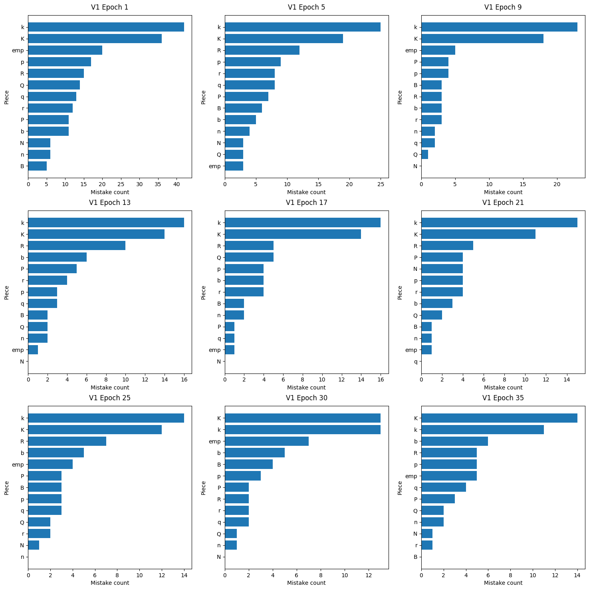

# RL Chess Transformers

## General/Future TODOs

- Instead of having utilities in colab notebooks, create util.py files
- Add Q-Learning folder
- Add play folder which includes a UI for playing against our models
- Add a setup section explaining how to replicate results in colab

## Dataset

Data is originally from the [Lichess Elite Database](https://database.nikonoel.fr/). I made use of this [script](https://github.com/sgrvinod/chess-transformers/blob/main/chess_transformers/data/LE22c.sh) which uses pgn-extract to extract the FENs, moves, and outcomes of the games within the pgn files. Note that the script applies a filter to keep only games that ended in checkmate and that used a time control of at least 5 minutes. 

The dataset consists of 26,701,685 half-moves described in UCI format, with the corresponding FEN positions.

The raw moves and FENs may can be downloaded here: [Moves](https://drive.google.com/uc?export=download&id=1BSBuF2dKOnVWuR5CNjp-o7QBYb-10JTO) and [FENS](https://drive.google.com/uc?export=download&id=1MC9UTgqE5074gVSVzrDzIJT7Hg1MHQac). 

## GRPO

The basic gist is we start with random board states from our dataset <board> fen </board> <moves> and have the model play against itself. However, we only consider the starting color given by the fen to be the color of our policy and the other to be the environment responding. For example, if we have: <board> fen </board> <moves> m1 m2 m3 m4 only m1 and m3 are considered to be policy moves. The reason for this is because I thought optimizing the win on both sides would not yield a strrong enough signal so if we optimize to win on one side, the model could make the opponent simply play bad to arbritrarily increase the objective. In this example, there would be two rewards in the form of r = after_eval - base_eval. The current board state is measured for the base_eval, and for every base_eval two moves are played to get the after_eval: the policy move and then the response move from the opponent. Techincally there would be four rewards, but two of them would be masked to be zero. 

FOr every sequence there are multiple rewards so these is process supervision GRPO as opposed to outcome supervision. The Advantage is calculated by taking the cumulative sum of future rewards.

Right now this does not work. It could be because the concept is wrong, the training setup is incorrect, or the code has errors. The code is taken from the source code of the GRPO trainer and modified, and verified with chatty so I don't think that is it. The training seems to be wrong because we get huge spikes in the loss for certain batches, and the actual objective excluding the kl-term does not seem to be non-decreasing. 

### Pretrained Model

#### Evaluations

##### Legal move Accuracy

Results are achieved from testing the model checkpoints on one randomly samples position from 1000 games. The samples are the same across all of the checkpoints. Top-k sampling is used with k = 10. 

The distribution of mistakes broken down by piece type across various checkpoints:

##### Model vs Fairy-Stockfish

Below are the results of the estimated elo differences between the v1 model and various levels of fairy-stockfish. The estimated elos for each level of fairy-stockfish, according to a random user on the Lichess forum, are:

- Level 1: under 400
- Level 2: 500
- Level 3: 800
- Level 4: 1100

Detailed metrics across all levels

|   Level |   Games |   Wins |   Losses |   Draws | Elo $\Delta$         |   Win Ratios |   Likelihood of Superiorities |
|---------|---------|--------|----------|---------|-------------------|--------------|-------------------------------|
|       1 |     200 |    129 |        0 |      73 | 262.60 (+-39.24)  |    0.819307  |                             1 |
|       2 |     200 |     88 |        2 |     112 | 157.97 (+-30.20)  |    0.712871  |                             1 |
|       3 |     200 |      2 |      148 |      52 | -317.36 (+-47.84) |    0.138614  |                             0 |
|       4 |     200 |      1 |      180 |      21 | -487.68 (+-78.48) |    0.0569307 |                             0 |

