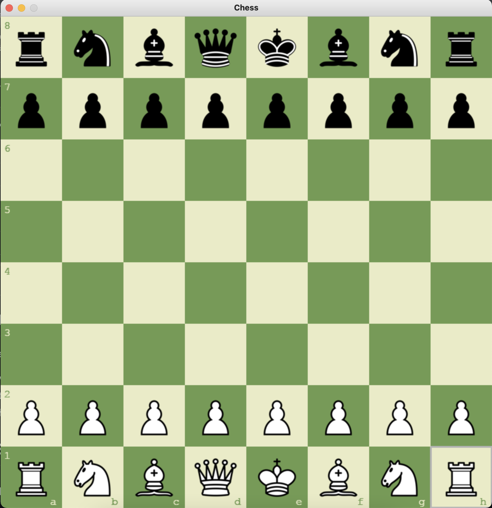
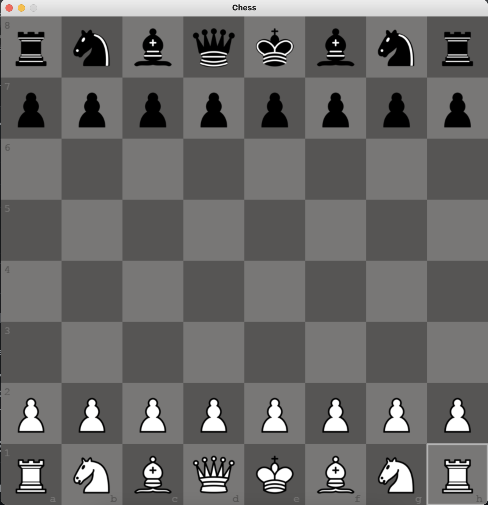

# Python Chess UI with AI

A classic chess game implemented in Python using Pygame, where you can play against an AI opponent powered by a neural network model.

## Features

* Play chess as White against an AI opponent playing as Black.
* The AI uses a pre-trained best model (`model_checkpoint.pt`) with sampling strategy to predict moves.
* Interactive UI with drag-and-drop for pieces.
* Visual indication of valid moves when a piece is picked up.
* Highlighting of the last move made.
* Changeable board themes (Green, Brown, Blue).
* Game restart functionality.

## Setup and Running the Game

1.  **Prerequisites:**
    * Python 3.x (tested with 3.11)
    * Pygame: `pip install pygame`
    * python-chess: `pip install chess`
    * PyTorch: `pip install torch torchvision torchaudio` (ensure you get a version compatible with your system, CPU or GPU)
    * Ensure all other necessary Python packages from the `ai_engine` (like `tqdm`, `numpy` if not already for PyTorch) are installed.

2.  **Project Structure:**
    Ensure your project has the following structure, especially the `assets` folder and the `ai_engine/trained_models` for the AI to function correctly:
    ```
    python-chess-UI/
    ├── assets/
    │   ├── fonts/ (e.g., DejaVuSansMono.ttf or your preferred font)
    │   ├── images/
    │   │   └── imgs-80px/ (containing piece images like white_pawn.png)
    │   └── sounds/ (move.wav, capture.wav)
    ├── src/
    │   ├── __init__.py
    │   ├── main.py
    │   ├── game.py
    │   ├── config.py
    │   └── ai_engine/
    │       ├── __init__.py
    │       ├── ai_interface.py
    │       └── trained_models/
    │           └── model_checkpoint.pt
    └── README.md
    ```
    *Make sure to place your `model_checkpoint.pt` file inside `src/ai_engine/trained_models/`.*
    *Populate the `assets` folder with the required font, images, and sounds.*

3.  **Running the Game:**
    * Navigate to the root directory of the project (i.e., `python-chess-UI/`) in your terminal.
    * Run the game using the command:
        ```bash
        python -m src.main
        ```
    * This method ensures that Python correctly handles the package structure and imports.

## Game Instructions

* **Objective:** Play chess against the AI. You will play as White, and the AI will play as Black.
* **Making Moves:** Click and drag your (White) pieces to their desired legal squares. Valid move destinations will be indicated when you pick up a piece.
* **AI's Turn:** After you make a move, the AI will "think" (using its loaded model) and then make its move.
* **Controls:**
    * **`t`**: Press 't' to cycle through different board themes (e.g., green, brown, blue).
    * **`r`**: Press 'r' to restart the game at any time.

## Game Snapshots

(Your existing snapshots section can remain here)

## Snapshot 1 - Start (green)


## Snapshot 2 - Start (brown)


## Snapshot 3 - Start (blue)


## Snapshot 4 - Start (gray)


## Snapshot 5 - Valid Moves


## Snapshot 6 - Castling


---